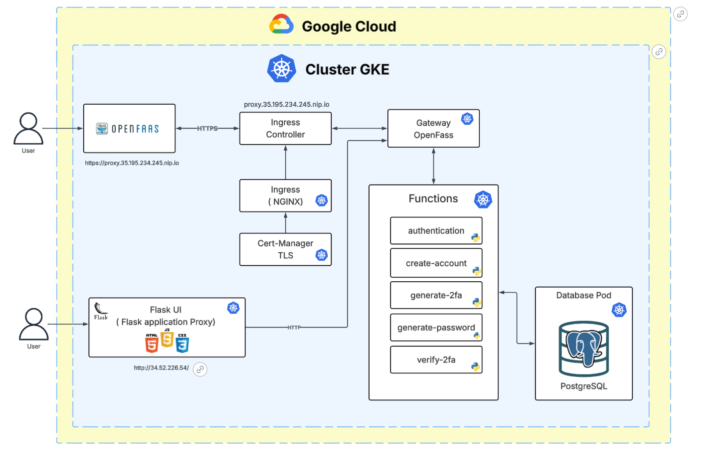

# Architecture Générale du Projet MSPR – GKE, OpenFaaS, Cert-Manager, Frontend

## 🎯 Objectif du projet
Fournir une plateforme sécurisée d’authentification avec gestion de comptes utilisateurs, mot de passe fort, 2FA (TOTP), et un frontend interactif, le tout en mode serverless avec Kubernetes.

---

## ☁️ Composants Cloud déployés

### 📌 Cluster GKE Autopilot (Google Cloud)
- 3 nœuds (e2-medium)
- Namespace :
  - `openfaas` pour les composants OpenFaaS
  - `openfaas-fn` pour les fonctions serverless et PostgreSQL
  - `default` pour le proxy Flask
  - `ingress-nginx` pour le contrôleur Ingress
  - `cert-manager` pour la gestion TLS

---

## 🔧 OpenFaaS

### 🔹 Fonctions déployées (namespace: openfaas-fn)

| Fonction                | Rôle                                                                 |
|-------------------------|----------------------------------------------------------------------|
| `create-account-secure`| Crée un compte utilisateur avec mot de passe fort                    |
| `authentication`        | Authentifie l’utilisateur avec la base PostgreSQL                   |
| `generate-password`     | Génère un mot de passe complexe                                      |
| `generate-2fa`          | Crée un secret TOTP + QR code et l’enregistre                       |
| `verify-2fa`            | Vérifie le token TOTP fourni par l’utilisateur                      |

---

## 🛢️ Base de données

### PostgreSQL
- Déployé comme pod dans `openfaas-fn`
- Service `postgres` (port 5432)
- Utilisé par les fonctions pour stocker :
  - username
  - mot de passe hashé (bcrypt)
  - secret 2FA
  - expiration

---

## 🌐 Frontend Flask

### Proxy `mspr-proxy` (namespace: default)
- Sert les pages HTML (login, signup, dashboard, etc.)
- Redirige les appels `/f/<fonction>` vers OpenFaaS gateway
- Image : `chtaybo22/mspr-proxy:latest`
- Service : `mspr-proxy-service` (LoadBalancer `34.52.226.54`)

---

## 🔐 HTTPS & Ingress

### Ingress NGINX
- Déployé dans `ingress-nginx`
- LoadBalancer : `35.195.234.245`

### Cert-Manager
- Fournit des certificats Let's Encrypt
- ClusterIssuer : `letsencrypt-prod`

### Ingress TLS OpenFaaS
- `https://openfaas.35.195.234.245.nip.io` → `gateway` OpenFaaS

### Ingress TLS Flask (à faire ou en cours)
- `https://proxy.35.195.234.245.nip.io` → `mspr-proxy-service`

---

## 📡 Services réseau (résumé)

| Nom                      | Type          | Externe              | Port(s)      |
|--------------------------|---------------|----------------------|--------------|
| `gateway`                | LoadBalancer  | 34.38.245.109        | 8080         |
| `mspr-proxy-service`     | LoadBalancer  | 34.52.226.54         | 80           |
| `ingress-nginx`          | LoadBalancer  | 35.195.234.245       | 80 / 443     |

---

## ✅ Points forts de l’architecture

- 💡 Serverless via OpenFaaS = scalable
- 🔐 HTTPS auto via Cert-Manager & Let's Encrypt
- 🧱 PostgreSQL sécurisé, accès uniquement en cluster
- 🌐 Frontend autonome mais intégré via proxy Flask
- 🧰 CI/CD possible via `faas-cli` + `docker push`

---

## 📌 Prochaine étape

- Ajouter HTTPS au `proxy-flask`
- Ajouter support JWT pour les sessions sécurisées
- Monitoring (Prometheus + Grafana)
- CI/CD automatisé avec GitHub Actions
